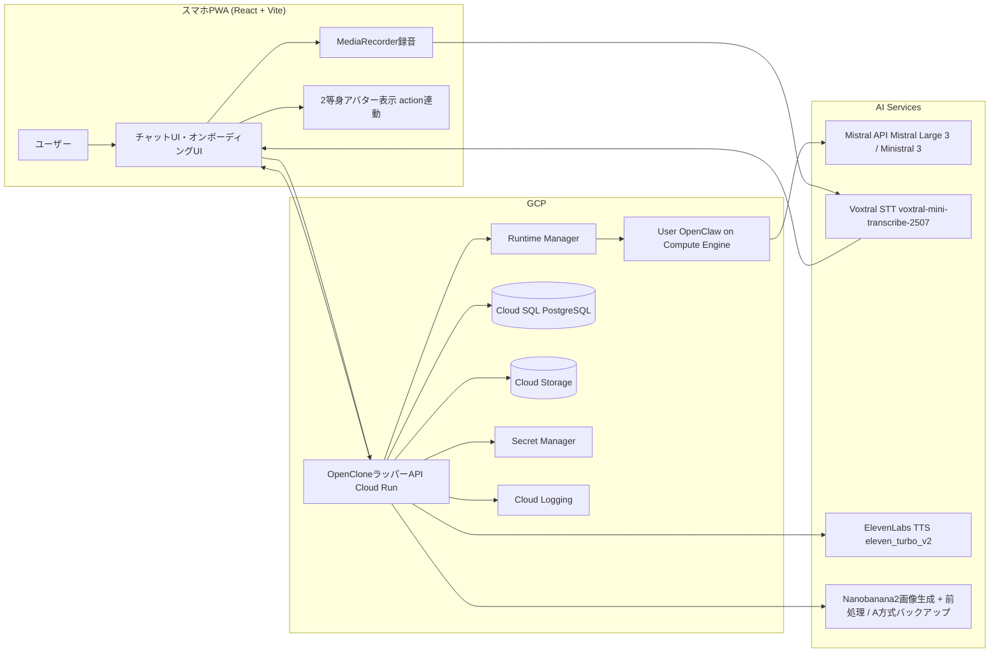

# OpenClone 構成図（drawio MCP）

## Draw.io URL
- https://app.diagrams.net/?grid=0&pv=0&border=10&edit=_blank#create=%7B%22type%22%3A%22mermaid%22%2C%22compressed%22%3Atrue%2C%22data%22%3A%22jVRRj6IwEP41TXYfTFhYFB4LwsYETk%2FUvbcNYo8l0dYUdO%2Fn30yhiFzNXoI4zDfz9etMp7%2BP4qv4zGVDbCtZE4vCPzz1ZV%2FK%2FPwJZnisGG%2BIGxDbJpFDPJsEvjIc4kfaCFbvmPq0ZnnRKA6It3ZVw54xz5331O2zHRA6hE47Iwj1EgOPMX9xR%2BC9aCZHe3rDg9iOK%2BjYKdUeHeWH9wrgmelg5z4YxOHyJlXrKGxlpexQ5WtWCHlgkkQ%2B8UIS2Gj4MfKYkumuzYWwGaFz4kGVPRJQQnvZeru%2BpZXEA9keoS%2BEeir9FRNtC5pRCa4EWGojLvEC4rsjAYwf0DZ0%2Fy1ctarQMKpedZ1YnhkPj4Iz3Ql%2F3An%2FpReLWXi0xOWAZbtwcznTlhrwpjox8KQ5z0uoqCl6GSZt%2BLbGCKsVlH%2BBCSWA1cTpfGmQJeJlBTpNJPMAOJ4A0tqynwm8V6JuSsnUh%2F38b1q2Gac1QoLSB9H6mGSskKz5Zl%2FJ8q2N1tyJKEF%2F%2Bd89pF2HKNY8Y%2FJaFaw2LpVu1t35repG5seuvwD030kucVuWozJihfEeNZ%2Fs3fJXS7sTf7rAbLOB97X9npyAYgIWrwtZ7dnEdq2ZkSnqWhwd2ZXxJN%2FDPqzNJsP9K9dHc5F78XG1jemLtCvlj5yLPdSc52ra%2FFd1N7jquMadByY1msL1gdOmLzQVA8M0V8ZMXVwzDPCmfT0opvlTdUu6OJhefD%2B2%2FUjARMfj0b5Ny7gCowZv4TeZECdqb8PevRj48T7SANo3BFuiEbS%2F58KDoIH2UPSrpLdF0oEfB1IDaN8QPGdmrih5AGDrzAiMrBmAoTQDOFEPUgYFu0celmX3Fw%3D%3D%22%7D

## Mermaidソース

## 備考
- 本図は `drawio MCP` で生成した構成図。
- OpenClawをユーザー専用Compute Engine上で実行する前提の構成図。
- フロントエンドは `React + Vite` を前提とする。
- STTは `Voxtral (voxtral-mini-transcribe-2507)`、TTSは `ElevenLabs (eleven_turbo_v2)` を前提としている。
- 画像生成はNanobanana2パイプラインを前提としている。
