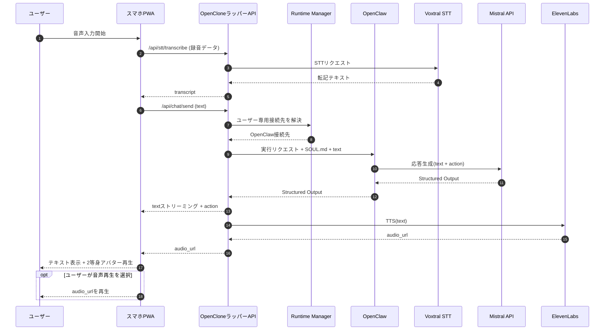
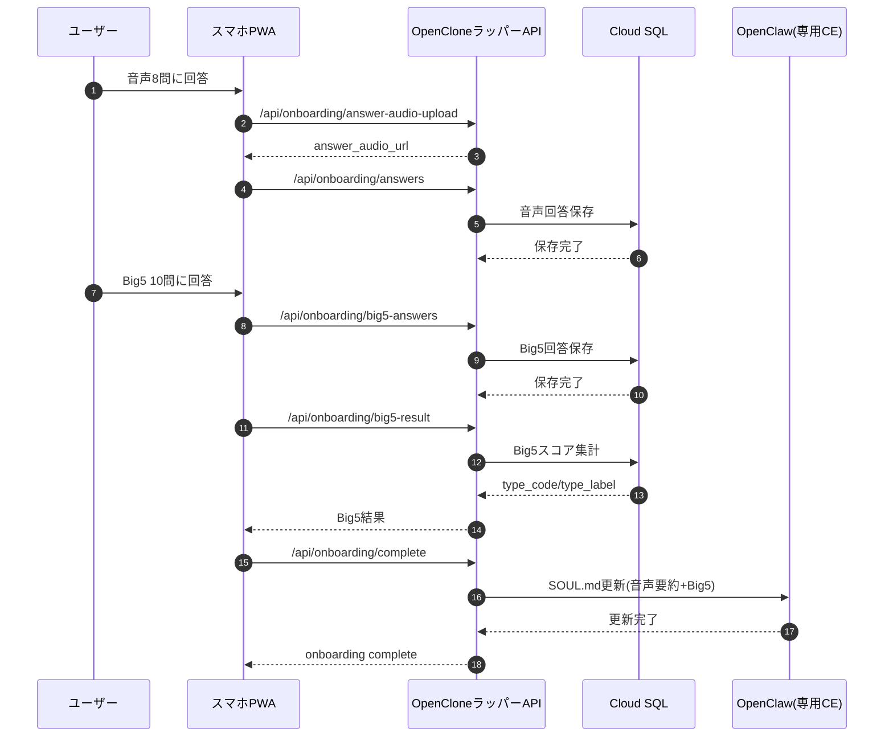
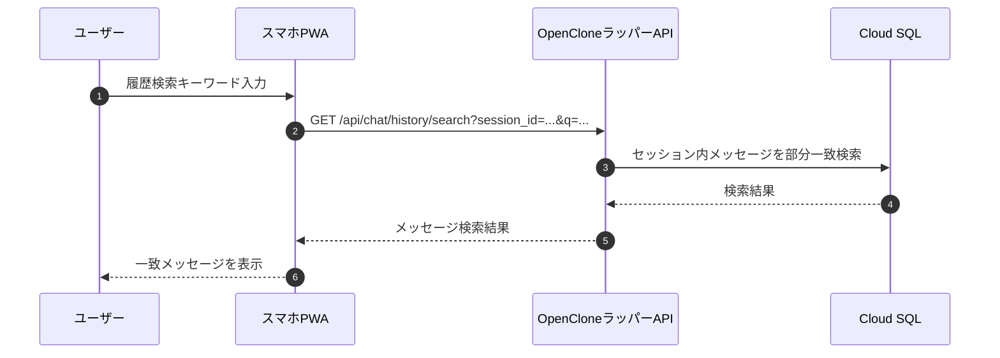

# OpenClone フロー図・シーケンス図（Mermaid）

## 1. 会話処理フロー図
```mermaid
flowchart TD
  A[ユーザー入力<br/>テキスト or 音声録音] --> B{入力種別}
  B -->|音声| C[/api/stt/transcribe]
  C --> D[Voxtral STT<br/>voxtral-mini-transcribe-2507]
  D --> E[入力テキスト確定]
  B -->|テキスト| E

  E --> F[/api/chat/send]
  F --> RM[Runtime Manager]
  RM --> OC[ユーザー専用OpenClaw実行基盤]
  OC --> G[Mistralで応答生成<br/>Structured Output: text + action]
  G --> H[テキストをストリーミング返却]
  G --> I[ElevenLabs TTS生成<br/>eleven_turbo_v2]
  I --> J[audio_url返却]
  H --> K[actionに応じて2等身アバター再生]
  J --> L[音声再生（任意）]
  K --> M[ターン完了]
  L --> M
```

## 2. 会話処理シーケンス図


## 3. オンボーディング + Big5 シーケンス図


## 4. 会話ログ検索シーケンス図

