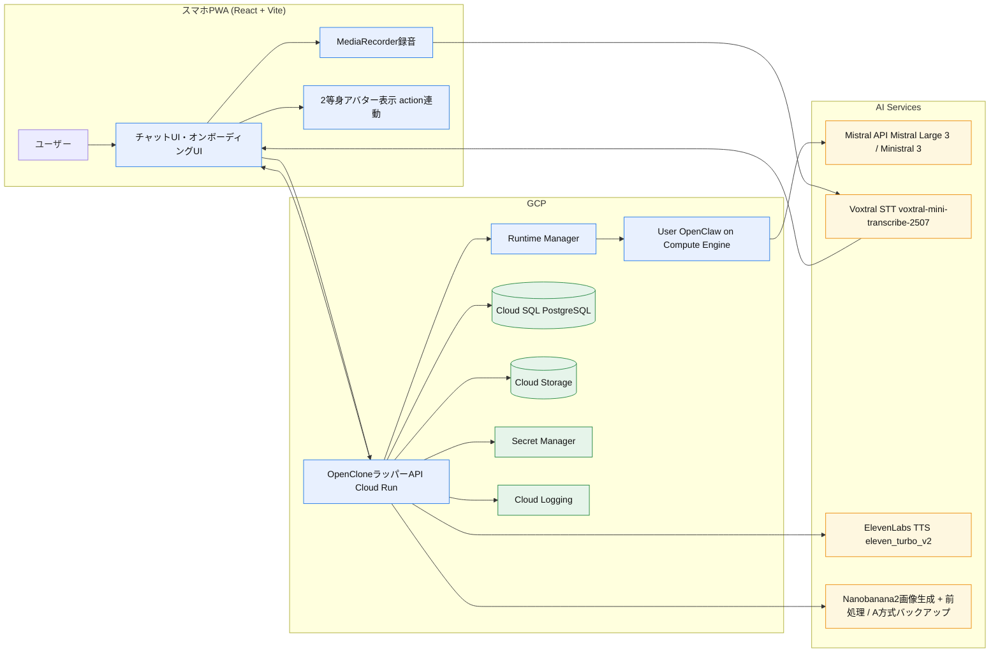

# OpenClone 設計書 v1.4（ハッカソン実装向け）

## 1. 目的
本書は [OpenClone 要件定義書](/Users/kokifunahashi/Documents/openclone/docs/requirements_definition.md) を実装可能な構成に落とし込むためのシステム設計を定義する。

## 2. 設計方針
- 優先順位:
  - 本人らしさ
  - 体感速度（応答開始1秒以下）
  - 実装速度（ハッカソン期間で完成）
- 方針:
  - OpenClawをバックエンド実行基盤として採用し、OpenCloneはラッパーUI/APIとして実装する
  - フロントエンド実装は `front_mock` をベースラインとして進める（新規画面は同じデザインシステム上で追加）
  - クラウドAPI活用を前提に最短構成で実装
  - LLMはMistralの推奨モデル群を利用する
  - 音声合成はElevenLabsを利用する
  - インフラはGCPに統一する
  - マイクロサービス分割は行わず、単一バックエンドで構築
  - 自動フォールバック実装は行わない（失敗時は明示エラーで扱う）

### 2.1 採用モデル方針（アナウンス準拠）
- メイン応答生成:
  - `Mistral Large 3` を第一候補
- 軽量応答/低コスト応答:
  - `Ministral 3B/8B/14B` を用途別に選択
- 音声リアルタイム認識（将来オプション）:
  - `Voxtral Realtime`
- 前提:
  - MVPのSTTはVoxtral API固定
  - Web Speech APIは採用しない
  - モデルIDは固定値で運用し、`latest` エイリアスは使用しない

## 3. 全体アーキテクチャ
### 3.1 構成要素
- フロントエンド（PWA）
  - 実装ベース: `front_mock`（React + Vite + TypeScript）
  - ルーティング: `/`（オンボーディング）, `/chat`（メイン会話）
  - UI基盤: Tailwind CSS v4 + Radix UI + Motion
  - チャットUI、オンボーディングUI、ドット絵表示
  - 音声入力（MediaRecorder録音 + Voxtral転記）とテキスト入力
- OpenCloneラッパーAPI
  - 認証、会話API、オンボーディングAPI、ログ管理API
  - OpenClaw連携、人格プロファイル適用、セーフティフィルタ、TTS連携
- OpenClaw基盤
  - ユーザー専用 Compute Engine 上でのOpenClaw実行
  - エージェント実行、モデル接続、チャネル制御
  - `Mistral Large 3` を既定モデルとして接続
- OpenClaw Runtime Manager
  - ユーザー登録時の専用インスタンス自動プロビジョニング
  - インスタンス状態管理（provisioning/running/failed/stopped）
  - ユーザーIDとOpenClaw接続先のマッピング管理
  - 接続先マッピングの正本は `user_openclaw_instances`（DB）に保持し、Runtime Managerはステートレス運用
- データストア
  - ユーザー、人格プロファイル、会話ログ
- 外部サービス
  - Mistral API（人格反映応答生成、Structured Output）
  - ElevenLabs TTS API（音声合成）

### 3.3 GCPインフラ構成（MVP）
- `Cloud Run`: OpenCloneラッパーAPI実行基盤
  - 初期設定: `min_instances=1`, `max_instances=20`, `concurrency=40`, `timeout=60s`
- `Compute Engine`: ユーザー専用 OpenClaw ランタイム実行基盤
  - 初期設定: `startup-timeout=180s`, `idle auto-stop=15min`, `max-lifetime=24h`
- `Cloud Storage (+ CDN)`: `front_mock` ビルド成果物（静的PWA）配信
- `Cloud SQL (PostgreSQL)`: ユーザー、人格、会話ログ保管
- `Cloud Storage`: 音声ファイル保管
- `Secret Manager`: APIキー管理（Mistral / ElevenLabs / OAuth）
- `Cloud Logging`: アプリログとレイテンシー計測ログ

### 3.2 データフロー（会話）
1. ユーザーがテキストまたは音声入力
2. 音声入力時はアプリ側がVoxtral STT経由で転記し、テキスト化する
3. OpenCloneラッパーAPIがユーザーIDに対応する専用OpenClawインスタンス接続先を解決する
4. OpenCloneラッパーAPIが会話履歴 + 人格プロファイルを付与して専用OpenClawへテキスト送信
5. OpenClaw経由でLLMがStructured Output（`text` と `action`）を生成
6. 応答テキストを即時ストリーミング返却（actionは先行確定で返却可）
7. OpenCloneラッパーAPIがOpenClawの応答テキストをElevenLabsでTTS生成し、`audio_url` を返却
8. フロントが `action` に対応する2等身ドット絵モーションを再生し、必要時に音声再生する
9. フロントが最終状態を `idle` へ戻す

### 3.4 OpenClaw責務分離
- OpenClaw側:
  - 専用インスタンス内のエージェント実行ライフサイクル
  - LLM実行パイプライン
  - チャネル接続基盤
- OpenCloneラッパー側:
  - ユーザー専用インスタンスの接続先解決
  - 人格プロファイル管理
  - Voxtral STT / ElevenLabs TTS
  - 2等身アバター制御
  - OpenClaw入出力のAPI整形

## 4. 画面設計（MVP）
### 4.0 `front_mock` 準拠方針
- MVPのフロントエンドは `front_mock/src/app` の画面構成・コンポーネント分割を基準実装とする
- 画面遷移は `front_mock/src/app/routes.ts` を基準にし、追加画面は要件確定後にルート拡張する
- オンボーディングは単一ルート `/` 内のステージ遷移で実装する（別URLへの分割は行わない）

### 4.1 画面一覧
- `/`（オンボーディング）
  - `intro`: 説明、開始導線
  - `profile`: 名前・顔写真アップロード
  - `voice`: 8問固定質問の音声回答（1問ずつ）
  - `big5`: Big5質問10問（固定）
  - `generating`: 生成待機演出（20秒超過時はストーリー演出ループ）
  - `complete`: Big5タイプ表示付き完了演出とチャット遷移
- `/chat`
  - メッセージリスト
  - テキスト入力欄
  - 音声入力ボタン
  - 2等身ドット絵アバター（action連動）
  - 初期フォーカスはテキスト入力
- `settings/data`（MVP v1.1で追加）
  - 会話ログ削除（手動、メッセージ単位）
  - 人格再設定（オンボーディング再実行）

### 4.2 UX要件
- 復帰後24時間は会話履歴を維持
- 片手操作のため、入力領域を画面下部固定
- ネットワーク低速時は音声生成をスキップしてテキスト先行
- 生成待機は20秒経過でチャット先行開始を許可する
- 20秒超で未完了の場合、オンボーディング側は1分/6ページ構成のストーリー演出をループ表示する
- BGMと効果音を導入する（オンボーディング/メイン共通）

## 5. バックエンド設計
### 5.1 モジュール
- `auth`
  - MVPはGoogleログインのみで実装
  - 認証は `Authorization: Bearer <JWT>` ヘッダで扱い、Cookieベース認証は採用しない
  - state-changing API（POST/DELETE）は `Origin` 検証を必須化する
- `persona`
  - オンボーディング回答を正規化して人格プロファイル化
  - Big5スコア算出とタイプ分類
  - オンボーディング音声8問を連結した Voice Clone 作成（非同期）
  - 音声回答要約 + Big5結果を OpenClaw `SOUL.md` へ反映
- `chat`
  - 応答生成、履歴保存、ストリーミング返却
- `tts`
  - ElevenLabs呼び出し、音声キャッシュ
  - OpenClaw出力テキストの音声化
- `runtime`
  - ユーザー登録時プロビジョニングトリガ
  - Compute Engineインスタンス作成/監視
  - ユーザーIDとOpenClaw接続先のマッピング保持

**TTS実装仕様:**
- **デフォルト動作: テキストのみ**（音声生成はデフォルトOFF）
- 使用モデル: `eleven_turbo_v2`（高速・低コスト）
- ユーザー操作: 「音声再生」ボタン押下時にのみTTS生成
- ストリーミングAPI: 低レイテンシー対応
- キャッシュ戦略: 同一テキストの24時間キャッシュ
- TTS失敗時: `tts_failed` を返し、UIで再試行導線を提示
- **コスト削減効果**: ユーザー選択式により、TTS使用量を70-80%削減（目標$70/月→$15-20/月）
- `safety`
  - 入力/出力検査、拒否応答生成
  - プロンプトインジェクション検査（system指示上書き要求の拒否）
  - OpenClawガードレール（metadata/file/env/command要求の拒否）
  - `metadata.google.internal` 参照要求の明示拒否
- `experiment-tracking`（W&B Weave連携）
  - LLM呼び出しのトレーシング（prompt、response、latency）
  - 「本人らしさ」評価スコアのログ記録
  - プロンプトA/Bテストの管理
  - ファインチューニング実施時は学習ログを記録

### 5.2 応答生成ロジック（本人らしさ担保）

**アプローチ: プロンプトエンジニアリング + RAG**
- 入力コンテキスト:
  - 最新Nターン会話
  - 人格プロファイル（口調、価値観、判断軸、NG表現）
  - 長期メモリ要約
- 出力制御:
  - 口調テンプレート層（語尾、一人称、呼称）
  - 判断方針層（優先順位ルール）
  - セーフティ層（NGカテゴリ拒否）
  - アクション選択層（発話意図に応じて `action` を選択）

**Mistral向けプロンプト構造:**
```
<system>
あなたは以下のペルソナとして振る舞ってください。

## 基本設定
- 名前: {name}
- 一人称: {first_person}
- 文体: {style}
- 語尾: {sentence_endings}

## 性格特性
- {trait_1}: {trait_1_description}
- {trait_2}: {trait_2_description}

## 価値観
大切にしていること:
- {value_1}
- {value_2}

判断基準:
1. {decision_criterion_1}
2. {decision_criterion_2}

## 会話例
{conversation_examples}

## 制約事項
- 不適切な要求には丁寧に断ってください
- ペルソナから逸脱しないようにしてください
</system>
```

**口調の多次元表現:**
- formality (0-1): 丁寧さ（タメ口〜敬語）
- energy (0-1): エネルギーレベル（冷静〜活発）
- directness (0-1): 直接性（遠回し〜ストレート）
- warmth (0-1): 温かさ（ドライ〜温かい）

**RAGによる会話履歴活用:**
- 会話履歴をベクトル化して保存（Sentence Transformers）
- 意味的チャンクへのセグメンテーション
- 関連性の高い過去発話の検索と注入

### 5.4 モデルルーティング設計（MVP）
- `default_chat_model`: `mistral-large-2512`
- `fast_chat_model`: `ministral-8b-2512`
- `cheap_background_model`: `ministral-3b-2512`
- `quality_chat_model`: `ministral-14b-2512`
- 使い分け:
  - 通常会話: `default_chat_model`
  - 低遅延優先（端末/回線悪化時の明示切替）: `fast_chat_model`
  - 将来バッチ処理（MVP外）: `cheap_background_model`
- 注意:
  - 自動フォールバックではなく、サーバ設定で明示切替する

### 5.3 Structured Output仕様（LLM）
- 目的:
  - テキスト生成とドット絵モーションを同期する
- 出力JSON（例）:
```json
{
  "text": "それ、いいね。まずは小さく試してみよう。",
  "action": "agree"
}
```
- `action` 候補（MVP）:
  - `idle`
  - `thinking`
  - `speaking`
  - `nod`
  - `agree`
  - `surprised`
  - `emphasis`
- 制約:
  - `action` は固定列挙値のみ許容
  - 無効値時は `speaking` に正規化


### 5.5 Big5スコアリング仕様（TIPI-J）
- 入力: Q1..Q10（各 1..7）
- 逆転項目: Q2, Q6, Q8, Q9, Q10（`rev = 8 - raw`）
- 次元スコア（1.0..7.0）
  - `E = (Q1 + rev(Q6)) / 2`
  - `A = (rev(Q2) + Q7) / 2`
  - `C = (Q3 + rev(Q8)) / 2`
  - `N = (Q4 + rev(Q9)) / 2`
  - `O = (Q5 + rev(Q10)) / 2`
- 正規化（0.0..1.0）: `normalized = (dimension_score - 1.0) / 6.0`
- タイプ分類
  - `Leader`: `E >= 0.6 and C >= 0.6`
  - `Supporter`: `A >= 0.6 and N <= 0.4`
  - `Creator`: `O >= 0.6 and E >= 0.5`
  - `Analyst`: `C >= 0.6 and O >= 0.5`
  - `Communicator`: `E >= 0.6 and A >= 0.5`
  - その他は `Balanced`
- トーンパラメータ
  - `Formality = 0.4*C + 0.3*(1-E) + 0.3*(1-O)`
  - `Energy = 0.4*E + 0.3*O + 0.2*(1-N) + 0.1*A`
  - `Directness = 0.4*(1-A) + 0.3*C + 0.2*E + 0.1*(1-N)`
  - `Warmth = 0.5*A + 0.2*E + 0.2*(1-N) + 0.1*O`

## 6. データモデル（MVP）
### 6.1 `users`
- `id`
- `auth_provider`
- `created_at`

### 6.2 `persona_profiles`
- `user_id`
- `style_traits`（口調、語彙）
- `decision_traits`（意思決定軸）
- `ng_topics`
- `voice_profile_ref`（ElevenLabs関連ID）
- `updated_at`

### 6.3 `onboarding_answers`
- `id`
- `user_id`
- `question_id`
- `answer_text`
- `answer_audio_url`
- `created_at`

### 6.3a `big5_answers`
- `id`
- `user_id`
- `onboarding_session_id`
- `question_id`（1..10, TIPI-J固定）
- `choice_value`（1..7）
- `is_reverse_item`
- `created_at`

### 6.3b `big5_results`
- `id`
- `user_id`
- `onboarding_session_id`
- `openness_score_raw`（1.0..7.0）
- `conscientiousness_score_raw`（1.0..7.0）
- `extraversion_score_raw`（1.0..7.0）
- `agreeableness_score_raw`（1.0..7.0）
- `neuroticism_score_raw`（1.0..7.0）
- `openness_score`（0.0..1.0）
- `conscientiousness_score`（0.0..1.0）
- `extraversion_score`（0.0..1.0）
- `agreeableness_score`（0.0..1.0）
- `neuroticism_score`（0.0..1.0）
- `tone_formality`
- `tone_energy`
- `tone_directness`
- `tone_warmth`
- `type_code`
- `type_label_ja`
- `computed_at`

### 6.4 `chat_messages`
- `id`
- `user_id`
- `session_id`
- `role`（user/assistant）
- `text`
- `action`
- `audio_url`（任意）
- `safety_flag`
- `created_at`
- `session_id` は128bit以上の暗号学的乱数（UUIDv4等）で生成し、全アクセスで `user_id` 所有権照合を必須とする

### 6.5 `user_openclaw_instances`
- `id`
- `user_id`
- `instance_name`
- `zone`
- `private_ip`
- `status`（provisioning/running/failed/stopped）
- `model_id`（例: `mistral-large-2512`）
- `openclaw_version`
- `created_at`
- `updated_at`

### 6.6 `motion_assets`
- `id`
- `action_name`
- `frame_sequence`（フレーム参照配列）
- `fps`
- `loop_flag`
- `created_at`

### 6.7 `pixelart_generation_jobs`
- `id`
- `user_id`
- `status`（queued/processing/completed/failed）
- `photo_url`（元写真のCloud Storageパス）
- `generated_face_url`（Nanobanana2生成画像のCloud Storageパス）
- `assets_prefix`（生成アセットのCloud Storageパス）
- `output_size`（例: `64x64`）
- `pipeline_version`（例: `nanobanana2-v1`）
- `progress`（0-100）
- `error_message`（失敗時）
- `started_at`
- `completed_at`

### 6.8 `voice_clone_jobs`
- `id`
- `user_id`
- `onboarding_session_id`
- `status`（queued/processing/ready/failed）
- `source_audio_urls`（オンボーディング8問の音声URL配列）
- `concatenated_audio_url`
- `voice_profile_ref`（ElevenLabs voice_id）
- `error_message`
- `started_at`
- `completed_at`

## 7. API設計（MVP）
### 7.1 認証
- `POST /api/auth/login`
- `POST /api/auth/logout`
- `GET /api/auth/me`

### 7.2 オンボーディング
- `POST /api/onboarding/start`
- `POST /api/onboarding/answer-audio-upload`（回答音声アップロード）
  - 入力: audio file (multipart/form-data)
  - 出力: answer_audio_url
- `POST /api/onboarding/answers`
- `POST /api/onboarding/big5-answers`
  - 入力: `onboarding_session_id`, `question_id`, `choice_value`
  - 処理: Big5回答保存
- `GET /api/onboarding/big5-result?onboarding_session_id=...`
  - 出力: Big5 5因子スコア + タイプ分類結果
- `POST /api/onboarding/photo-upload`（写真アップロード）
  - 入力: photo file (multipart/form-data)
  - 処理: Cloud Storage保存 + Nanobanana2顔生成取得 + リサイズ/減色/背景透過ジョブ起動
  - 出力: job_id, status
- `GET /api/onboarding/pixelart-status/{job_id}`
  - 出力: status (queued/processing/completed/failed), progress, asset_urls
- `POST /api/onboarding/complete`
  - 完了条件: 音声8問 + Big5 10問が保存済み、かつ Voice Clone が `ready`
- `POST /api/onboarding/voice-clone/start`
  - 入力: `onboarding_session_id`
  - 処理: 音声8問を全量連結してElevenLabs Voice Cloneジョブ開始（品質フィルタなし）
  - 出力: `job_id`, `status`
- `GET /api/onboarding/voice-clone-status/{job_id}`
  - 出力: `status`, `voice_profile_ref`, `error_message`
- `GET /api/runtime/status`
  - 出力: ユーザー専用OpenClawインスタンス状態（provisioning/running/failed/stopped）

### 7.3 会話
- `POST /api/stt/transcribe`
  - 入力: audio file (multipart/form-data)
  - 処理: Voxtralで音声転記
  - 出力: transcript
- `POST /api/chat/send`
  - 入力: `text`（音声入力時は `/api/stt/transcribe` の結果テキストを利用）
  - 出力: `streamed_text`, `action`, `audio_url`
- `GET /api/chat/history?session_id=...`
- `GET /api/chat/history/search?session_id=...&q=...`
  - 出力: メッセージ検索結果（部分一致）

### 7.4 データ管理
- `DELETE /api/data/chat-logs/{message_id}`
  - 無期限保存データをユーザー操作でメッセージ単位削除

## 8. セーフティ設計（MVP最小ガードレール）

### 8.1 ブロック対象
- 違法行為の具体的支援
- 差別/ヘイトスピーチ
- 露骨な性的コンテンツ
- 自傷他害の具体的助長
- 個人情報の不正取得・漏えい誘導

### 8.2 実装方式（MVP最小構成）
- **Mistral safe_prompt**: `safe_prompt=true` をAPI呼び出し時に設定
- **Delimiter-based separation**: システムプロンプトとユーザー入力を明確に分離
- **出力フィルタ**: 簡易的なNGワードチェック（日本語・英語）
- **拒否応答**: 「ごめんね、その話題はちょっとNGなんだ」といった本人口調での断り
- **SOUL.md固定**: 音声回答要約 + Big5結果を `SOUL.md` に保存し、system最上位で固定
- **ホスト防護**: `metadata / file / env / shell` 参照要求は拒否し、回答専用に限定
- **ネットワーク防護**: OpenClaw実行VMから `metadata.google.internal` への到達をOSレベルで遮断

### 8.3 v1.1以降の拡張予定
- LLMベースの入力・出力検査
- PIIマスキング/抑制チェック
- セーフティフィルタの誤検知統計と改善ループ

## 9. レイテンシー設計
### 9.1 目標
- 送信完了から初回文字表示まで `p95 <= 1.0秒`

### 9.2 予算配分（目安）
- API受信〜プロンプト構築: 120ms
- LLM初回トークン: 450ms
- 回線往復 + 描画: 180ms
- バッファ: 250ms

### 9.3 実装テクニック
- ストリーミング応答を必須化
- 会話履歴は長文全量ではなく要約+直近Nターン
- TTSは非同期並列（テキスト表示を待たせない）
- よく使う人格情報はメモリキャッシュ

### 9.6 レート制御（MVP固定）
- `per_user`: 60 req/min
- `burst`: 10 req/10sec
- 制限超過時は `429` と `Retry-After` を返す

## 9.4 STT運用方針（MVP）
- STTは **Mistral Voxtral API** を採用する（iOS Safari対応のため）
- **実装方式**:
  - クライアント: MediaRecorder APIで音声録音
  - サーバー: 録音ファイルをMistral Voxtral APIに送信して転記
  - レスポンス: 転記テキストをストリーミングで返却
- **採用モデル**: `voxtral-mini-transcribe-2507`（固定ID）
- **対応ブラウザ**: `iOS Safari` と `Android Chrome`（MediaRecorder API対応）
- **音声フォーマット**:
  - サンプリングレート: 16kHz
  - フォーマット: WAV/WebM
  - 最大録音時間: 30秒/回
- **将来検討事項**:
  - Voxtral Realtime APIへの切替（低レイテンシー要求時）
  - 自動フォールバックは実装しない

## 9.5 モーション資産運用（MVP）
- 本人特徴を残した2等身デフォルメ全身をベース生成し、モーションごとに差分フレームを生成する
- 生成後は `motion_assets` に登録し、ランタイムでは再生成しない
- LLMはフレームを直接生成せず、`action` ラベルのみ返す

### 9.5.1 全身ベース + モーション差分生成（Nanobanana2方式 / MVP採用）

**方式概要**
1. オンボーディングで顔写真を1枚アップロード
2. Nanobanana2へ参照画像を渡し、2等身デフォルメの全身ベース画像を1枚生成
3. モーションごとに定義済みポージング（MVP: 6コマ）を適用し、ベース画像参照で差分フレームを生成
4. フレームをPNGで保存し、モーション単位でGIFを書き出す
5. `action` ラベルとモーションGIF/フレーム群を紐づけて配信する

**技術スタック（MVP）**
- 全身/フレーム生成: **Nanobanana2 API**
- 画像処理: Pillow（GIF化、コンタクトシート作成、軽微な正規化）
- 配信: Cloud StorageにPNGスプライト/GIF保存

**生成解像度**
- 生成解像度はモデル出力解像度を基本とし、必要時のみ表示系でスケール調整
- 1モーションの基本フレーム数: `6`

**生成コスト/速度**
- 1ユーザーあたり生成は数十秒〜数分想定（GPU利用前提）
- オンボーディング時に非同期ジョブで生成し、完了後に反映する

**制約**
- MVPは「人物同一性の維持」と「モーション視認性」を優先
- 生成揺れが大きい場合は seed固定 + プロンプト固定で再生成
- 顔写真は品質ゲートを導入するが、閾値詳細は後続バージョンで定義する

### 9.5.2 方式採用（MVP標準）
**Nanobanana2パイプライン方式（標準）**
- `Nanobanana2(全身ベース生成) -> Nanobanana2(ポーズ差分生成) -> GIF化` を固定フローとする
- 1枚写真から全身ドット絵モーション資産を事前生成し、実行時は action で切替再生する
- 同一人物らしさとフレーム間の一貫性を優先する

**代替実装候補（A方式）**
- MediaPipe + OpenCV + Pillowで全身パーツ分解/再合成してフレーム生成
- Nanobanana2パイプラインが品質/運用要件を満たさない場合のみ採用

**切替条件**
- 週次サンプル評価で品質未達と判断された場合、A方式への切替を検討
- 自動フォールバックは行わず、運用判断で切替する
### 9.5.3 オンボーディング音声収集フロー

**音声収集方式: オンボーディング8問への音声回答**
- 固定8問それぞれに音声回答を収集する
- 収集音声はSTT品質向上とTTS設定の参照データとして利用する

**音声品質要件:**
- フォーマット: MP3, WAV, M4A, OGG
- サンプリングレート: 44.1kHz 以上
- ビットレート: 128kbps 以上（推奨192kbps）
- 録音環境: 背景ノイズのない静かな環境

**UI設計:**
- ステップ1: 説明画面（所要時間、プライバシー説明）
- ステップ2: 環境チェック（マイク権限、ノイズレベル）
- ステップ3: 録音画面（スクリプト表示、録音ボタン）
- ステップ4: 確認画面（再生、録り直し、次へ）

## 10. 人格確定方針（MVP）
1. オンボーディング回答を元に `persona_profiles` を確定する
2. Voice Clone はオンボーディング8問の音声を全量連結して非同期作成する（再作成はMVP対象外）
3. MVP中は会話ログによる自動更新を行わない
4. 人格変更が必要な場合はオンボーディング再実行で更新する

## 11. 運用設計（ハッカソン）
- 監視最小構成:
  - APIエラー率
  - 応答開始レイテンシー（p50/p95）
  - TTS失敗率
- アラート閾値（初期値）:
  - `p95 latency > 1000ms` が5分継続
  - `error rate > 1%` が3分継続
  - `openclaw_timeout > 2%` が3分継続
- 障害時方針:
  - 自動縮退は行わない
  - 失敗はエラーとして返却し、運用側で再実行または復旧対応する

## 11.1 セキュリティ運用
- シークレットローテーション:
  - Mistral / ElevenLabs / OAuthキーは90日ごとにローテーション
  - Secret Managerのバージョン固定参照で段階切替を行う
- 監査ログ:
  - すべての会話APIで `request_id`, `user_id`, `session_id`, `openclaw_instance_id` を構造化ログ出力
- トレースログ最小マスキング:
  - Weave記録前にメールアドレス/電話番号/クレカ形式をマスクする（完全PII対策はv1.1以降）

## 11.2 バックアップ・復旧
- Cloud SQL:
  - PITR有効化（保持7日）
  - 日次バックアップ + 週次リストア検証
- Cloud Storage:
  - 音声/画像バケットでオブジェクトバージョニングを有効化
  - ライフサイクルで古い中間生成物を自動削除

## 11.3 W&B Weave活用設計

### 11.3.1 目的

**主目的: トレーシング**
- OpenClaw経由のLLM呼び出しを包括的にトレーシングし、パフォーマンスと品質を可視化
- 全チャットレスポンスのログを記録し、改善サイクルを回す

**副次的な目的:**
- Mistralモデルのファインチューニング（FTトラック時）の学習管理
- 実験・評価の追跡（プロンプトA/Bテスト等）

### 11.3.2 管理対象（トレーシング中心）

**LLM呼び出しのトレーシング（主要・OpenClaw経由）:**
- **OpenClaw外側でのトレーシング（OpenCloneラッパー実装）:**
  - OpenClawチャネルID（呼び出し元の追跡）
  - OpenClawへの入力プロンプト（システムプロンプト + 人格プロファイル + ユーザー入力）
  - OpenClawからの出力レスポンス（text + action）
  - OpenClaw処理時間（OpenClaw呼び出し〜レスポンス完了まで）
- **OpenClaw内側のトレーシング（OpenClaw次第・可能な場合）:**
  - Mistral APIへの生のリクエスト/レスポンス
  - チャネル制御のライフサイクル
  - エージェント実行の各ステップ
  - ※OpenClawがトレーシング用のフックや計装機能を提供している場合に実装

**記録禁止情報（必須）:**
- APIキー、アクセストークン、シークレット値
- 生の認証ヘッダ/クッキー
- マスク前のPII

**レイテンシー測定ポイント:**
- ユーザー入力確定
- OpenClaw呼び出し開始
- OpenClawレスポンス完了
- （OpenClaw内側で計測可能な場合）Mistral API初回トークン受信

**記録項目（全LLM呼び出し）:**
- プロンプト（システムプロンプト + 人格プロファイル + ユーザー入力、最小マスキング後）
- レスポンス（text + action）
- トークン数（入力/出力）
- 使用モデル（mistral-large-2512等）
- 人格プロファイルバージョン（persona_profile_v1.0等）
- ユーザーID、セッションID、タイムスタンプ

**各チャットレスポンスの評価:**
- ユーザー評価（各レスポンスに対する5段階評価）
- 応答速度満足度（5段階）
- 評価タイミング: チャット画面でリアルタイムに収集（レスポンス表示後に評価UIを提示）

**レイテンシー評価:**
- p50/p95/p99レイテンシーの分布追跡
- 目標値: p95 <= 1000ms
- アラート: p95 > 1000msで警告

**人格プロファイルのバージョニング:**
- オンボーディング完了時の人格スナップショットを保存
- オンボーディング再実行時のバージョン管理
- 人格変更履歴の追跡

**実験・評価の追跡:**
- プロンプトテンプレートのバージョニング
- プロンプトA/Bテスト（複数バリアントの比較）
- ハイパーパラメータ（温度、top_p等）

### 11.3.3 トレーシング設計

**OpenClaw外側でのトレーシング（OpenCloneラッパー実装）:**

トレースポイント:
1. ユーザー入力受信時
2. OpenClaw呼び出し前（入力プロンプト構築後）
3. OpenClawレスポンス受信時
4. レスポンス完了時（フロントへ返却後）

記録項目:
- 入力: ユーザーテキスト/音声転記、人格プロファイルバージョン
- 出力: 応答テキスト、アクション種別
- パフォーマンス: 各トレースポイントのタイムスタンプ
- コンテキスト: セッションID、会話ターン数、OpenClawチャネルID

**OpenClaw内側でのトレーシング（OpenClaw次第）:**

OpenClawが以下の機能を提供している場合、内部処理もトレーシング可能:
- 計装フック/コールバック機能
- ログ出力機能
- ミドルウェア拡張機能

可能な場合のトレースポイント:
- Mistral API呼び出し前
- Mistral APIレスポンス受信時
- チャネル制御の各ステップ
- エージェント実行ライフサイクル

※MVPではOpenClaw外側でのトレーシングを実装し、OpenClaw内側はOpenClawの機能提供状況に応じて検討

### 11.3.4 評価設計（チャットレスポンスごと）

**ユーザー評価の収集:**
- レスポンス表示後に「この回答はどうでしたか？」UIを提示
- 5段階評価: 「とても良い」「良い」「普通」「悪い」「とても悪い」
- 評価は任意（スキップ可）
- 評価結果をWeaveにログ記録

**記録項目:**
- ユーザーID、セッションID、レスポンスID
- 評価スコア（1-5）
- 人格プロファイルバージョン
- 使用モデル
- レイテンシー
- 評価タイムスタンプ

### 11.3.5 レイテンシー評価設計

**測定ポイント:**
- ユーザー入力確定（送信ボタン押下/音声入力完了）
- OpenClaw呼び出し開始
- LLM初回トークン受信
- レスポンス完了

**集計・可視化:**
- p50/p95/p99レイテンシーの時間系列推移
- モデル別のレイテンシー比較
- 人格プロファイルバージョン別のレイテンシー比較
- アラート: p95 > 1000msが継続する場合に通知

### 11.3.6 人格プロファイル管理

**オンボーディング完了時:**
- 人格プロファイルをWeaveオブジェクトとして保存
- バージョン番号を付与（persona_v1.0, persona_v1.1等）
- オンボーディング回答との関連付け

**オンボーディング再実行時:**
- 新しいバージョンとして保存
- 変更点のログ記録（前回との差分）

### 11.3.7 実験・評価の追跡

**プロンプトA/Bテスト:**
- 複数のプロンプトテンプレートを比較
- 各バリアントの評価スコアを収集
- レイテンシーと品質のトレードオフ分析

**記録項目:**
- 実験名、バリアント名
- レスポンス品質（ユーザー評価）
- レイテンシー
- セッションID、ユーザーID

### 11.3.8 ファインチューニング・トラック対応（FT）

**学習管理:**
- 学習ログ: loss、learning_rate、epoch
- 評価結果: validation_accuracy
- モデルアーティファクト: チェックポイントの保存
- Weave Runで学習過程を可視化

### 11.3.9 Weaveドキュメント参照

- `weave/tracing-basics_ja.md`: トレーシング基礎
- `weave/evaluation-pipeline_ja.md`: 評価パイプライン構築
- `weave/weave-projects_ja.md`: プロジェクト管理と組織化

## 12. 実装順序（推奨）

### 12.0 W&B Weave導入（最初にセットアップ）

**プロジェクト初期化:**
- W&Bプロジェクト作成
- Weave初期化

**環境変数設定:**
- WANDB_API_KEYの設定
- WEAVE_PROJECTの設定

**基本トレーシング実装:**
- 全LLM呼び出しのトレーシング（OpenClaw経由）
- レイテンシー記録（各トレースポイントのタイムスタンプ）
- 人格プロファイルバージョンの記録

**評価ログ実装:**
- 各チャットレスポンスに対するユーザー評価のログ記録
- レイテンシー評価（p95 <= 1000msの監視）

**ダッシュボード作成:**
- Weave UIでダッシュボードを作成
- 主要指標（レイテンシー、評価スコア）を追加
- アラート設定（p95レイテンシー > 1000ms等）

### 12.1 実装順序（MVP）

1. **W&B Weave導入**（上記ステップ）
2. `chat` のテキスト応答をストリーミングで成立
3. `onboarding` 保存 + 人格プロファイル生成（Weaveバージョニング）
4. TTS連携 + ドット絵状態同期
5. セーフティフィルタ導入
6. ログ削除UI導入
7. **各チャットレスポンスの評価UI実装**（レスポンス表示後に評価ボタンを提示）

### 12.2 統合実装順 v1（フロント/バック同時開発）

1. **契約固定（完了）**
- `docs/contracts/openapi_v1.yaml` を唯一の正として固定
- `docs/contracts/error_catalog_v1.md` のエラーコードを固定

2. **Phase A: 並列着手（依存なし）**
- バックエンド: `BE-03`（DDL/Index/`pg_trgm` マイグレーション整備）
- フロントエンド: `FE-01`（`real/mock` APIクライアント抽象化 + Bearer JWT付与）

3. **Phase B: チャットMVP成立**
- バックエンド: `BE-22`, `BE-22a`, `BE-30`
- フロントエンド: `FE-02`, `FE-03`, `FE-04`, `FE-05`, `FE-06`

4. **Phase C: オンボーディング成立（Big5 + Voice Clone）**
- バックエンド: `BE-14`, `BE-27`, `BE-17`
- フロントエンド: `FE-07`, `FE-08`, `FE-09`, `FE-10`

5. **Phase D: アバター本実装追従**
- バックエンド: `BE-25`, `BE-26`
- フロントエンド: `FE-11`, `FE-12`, `FE-13`, `FE-14`

6. **Phase E: 運用・品質仕上げ**
- バックエンド: `BE-19`, `BE-20`, `BE-18`, `BE-21`, `BE-23`, `BE-24`, `BE-24a`, `BE-16`
- フロントエンド: `FE-15`, `FE-16`

7. **完了判定**
- `onboarding -> chat -> history -> search -> delete` が実APIモードで通る
- `onboarding/complete` は `voice-clone-status=ready` 前に実行不可
- SSEイベント順序（`token -> final -> done`）とエラー形式が契約と一致


## 13. 確定事項
以下は、2026-02-28時点で本プロジェクトのMVP仕様として確定している事項。

1. アーキテクチャ方針
- OpenClawをバックエンド実行基盤として採用する
- OpenCloneはユーザー向けラッパーUI/APIとして実装する
- 単一バックエンド構成（マイクロサービス分割なし）

2. 技術スタック
- フロントエンド: `React + Vite`（スマホPWA）
- バックエンド: `Node.js (TypeScript)`（Cloud Run）
- インフラ: `GCP`
- 認証: `Googleログインのみ`

3. モデル採用方針（固定ID運用）
- LLM:
  - `mistral-large-2512`（標準）
  - `ministral-8b-2512`（低遅延用）
  - `ministral-3b-2512`（軽量/将来バッチ用）
  - `ministral-14b-2512`（品質優先用）
- STT:
  - `voxtral-mini-transcribe-2507`
- TTS:
  - ElevenLabs `eleven_turbo_v2`
- モデルIDは `latest` エイリアスを使わない

4. 音声I/O仕様
- 音声入力は `MediaRecorder + Voxtral API` を標準採用
- `Web Speech API` は採用しない
- 外部STTの自動フォールバックは実装しない
- TTSはデフォルトOFF（ユーザーが音声再生を選択した時のみ生成）

5. オンボーディング仕様
- 質問数: `音声8問 + Big5 10問（固定）`
- 各質問の音声回答は必須（ElevenLabs声質再現データのため）
- Big5結果はスコア計算後にタイプ分類し、完了画面で表示
- 人格プロファイルはオンボーディング完了時に確定
- 音声回答要約 + Big5結果を OpenClaw `SOUL.md` に反映
- MVP中は会話ログによる人格自動更新を行わない

6. アバター仕様
- 2等身アバター固定
- 体テンプレ: `male/female x formal/casual` の4種
- 画像生成はNanobanana2パイプラインをMVP標準採用
- 処理順は `生成取得 -> 正規化 -> 64x64化 -> 背景透過 -> 合成` で固定
- バックアップはA方式（MediaPipe + OpenCV + Pillow）
- LLMのStructured Outputで `text` と `action` を分離

7. セーフティ・運用
- MVPは回答専用エージェント（外部アクション実行は無効）
- 会話ログは無期限保存、メッセージ単位削除
- 対応ブラウザは `iOS Safari` と `Android Chrome`

8. 実験管理・評価（W&B Weave）
- **主目的: トレーシング**: OpenClaw経由の全LLM呼び出しを記録
- **OpenClaw外側でのトレーシング（OpenCloneラッパー実装）**:
  - OpenClawチャネルID
  - OpenClawへの入力プロンプト（システムプロンプト + 人格プロファイル + ユーザー入力）
  - OpenClawからの出力レスポンス（text + action）
  - OpenClaw処理時間
- **OpenClaw内側でのトレーシング（OpenClaw次第・可能な場合）**:
  - Mistral APIへの生のリクエスト/レスポンス
  - チャネル制御のライフサイクル
  - エージェント実行の各ステップ
  - ※OpenClawがトレーシング用のフックや計装機能を提供している場合に実装
- **各チャットレスポンスの評価**: レスポンス表示後に「この回答はどうでしたか？」UIでリアルタイム収集（5段階評価、任意回答）
- **レイテンシー評価**: p95 <= 1000ms目標の追跡、アラート設定
- **人格プロファイル管理**: オンボーディング完了時のスナップショットをバージョニング
- **プロンプト実験**: プロンプトA/Bテストの結果追跡
- **ダッシュボード**: メインダッシュボードで主要指標を可視化
- **ファインチューニング**: FTトラック時は学習ログをWeave Runで可視化

## 14. 関連文書
- モデル実現可能性評価:
  - [model_feasibility_assessment.md](/Users/kokifunahashi/Documents/openclone/docs/research/model_feasibility_assessment.md)
- 顔ドット絵 + 体テンプレ合成の実現可能性:
  - [face_only_avatar_feasibility.md](/Users/kokifunahashi/Documents/openclone/docs/research/face_only_avatar_feasibility.md)
- drawio MCPで生成した構成図:
  - [architecture_drawio_mcp.md](/Users/kokifunahashi/Documents/openclone/docs/research/architecture_drawio_mcp.md)
- Mermaidのフロー図・シーケンス図:
  - [mermaid_flow_and_sequence.md](/Users/kokifunahashi/Documents/openclone/docs/research/mermaid_flow_and_sequence.md)
- OpenClaw調査メモ:
  - [openclaw_research.md](/Users/kokifunahashi/Documents/openclone/docs/research/openclaw_research.md)
- UI/UX設計（オンボーディング/メイン画面）:
  - [uiux_design_onboarding_main.md](/Users/kokifunahashi/Documents/openclone/docs/research/uiux_design_onboarding_main.md)
- フロントTODO（MVP並列開発）:
  - [frontend_todo_v1.md](/Users/kokifunahashi/Documents/openclone/docs/frontend_todo_v1.md)
- バックエンドTODO（MVP並列開発）:
  - [backend_todo_v1.md](/Users/kokifunahashi/Documents/openclone/docs/backend_todo_v1.md)
- API契約（並列開発固定）:
  - [openapi_v1.yaml](/Users/kokifunahashi/Documents/openclone/docs/contracts/openapi_v1.yaml)
- エラーカタログ（並列開発固定）:
  - [error_catalog_v1.md](/Users/kokifunahashi/Documents/openclone/docs/contracts/error_catalog_v1.md)

## 14.1 Draw.io 図版（MCP生成）
- Draw.io URL:
  - https://app.diagrams.net/?grid=0&pv=0&border=10&edit=_blank#create=%7B%22type%22%3A%22mermaid%22%2C%22compressed%22%3Atrue%2C%22data%22%3A%22jVRRj6IwEP41TXYfTFhYFB4LwsYETk%2FUvbcNYo8l0dYUdO%2Fn30yhiFzNXoI4zDfz9etMp7%2BP4qv4zGVDbCtZE4vCPzz1ZV%2FK%2FPwJZnisGG%2BIGxDbJpFDPJsEvjIc4kfaCFbvmPq0ZnnRKA6It3ZVw54xz5331O2zHRA6hE47Iwj1EgOPMX9xR%2BC9aCZHe3rDg9iOK%2BjYKdUeHeWH9wrgmelg5z4YxOHyJlXrKGxlpexQ5WtWCHlgkkQ%2B8UIS2Gj4MfKYkumuzYWwGaFz4kGVPRJQQnvZeru%2BpZXEA9keoS%2BEeir9FRNtC5pRCa4EWGojLvEC4rsjAYwf0DZ0%2Fy1ctarQMKpedZ1YnhkPj4Iz3Ql%2F3An%2FpReLWXi0xOWAZbtwcznTlhrwpjox8KQ5z0uoqCl6GSZt%2BLbGCKsVlH%2BBCSWA1cTpfGmQJeJlBTpNJPMAOJ4A0tqynwm8V6JuSsnUh%2F38b1q2Gac1QoLSB9H6mGSskKz5Zl%2FJ8q2N1tyJKEF%2F%2Bd89pF2HKNY8Y%2FJaFaw2LpVu1t35repG5seuvwD030kucVuWozJihfEeNZ%2Fs3fJXS7sTf7rAbLOB97X9npyAYgIWrwtZ7dnEdq2ZkSnqWhwd2ZXxJN%2FDPqzNJsP9K9dHc5F78XG1jemLtCvlj5yLPdSc52ra%2FFd1N7jquMadByY1msL1gdOmLzQVA8M0V8ZMXVwzDPCmfT0opvlTdUu6OJhefD%2B2%2FUjARMfj0b5Ny7gCowZv4TeZECdqb8PevRj48T7SANo3BFuiEbS%2F58KDoIH2UPSrpLdF0oEfB1IDaN8QPGdmrih5AGDrzAiMrBmAoTQDOFEPUgYFu0celmX3Fw%3D%3D%22%7D
- Mermaidソース:


## 15. コスト見積もりと最適化戦略
- 本版ではコスト検証を対象外とする（別紙で管理）。

## 16. 技術調査レポート

詳細な技術調査結果は以下のドキュメントを参照：

1. **ドット絵生成技術**
   - [research_pixelart_generation.md](/Users/kokifunahashi/Documents/openclone/docs/research/research_pixelart_generation.md)
     - Stable Diffusion、ControlNet、ComfyUI による実装手法
   - [photo_to_pixelart_guide.md](/Users/kokifunahashi/Documents/openclone/docs/research/photo_to_pixelart_guide.md)
     - 生成モデル方式の調査（比較用）
   - [nanobanana2_avatar_pipeline.md](/Users/kokifunahashi/Documents/openclone/docs/research/nanobanana2_avatar_pipeline.md) ✅
     - Nanobanana2ベースのMVP採用方式

2. **LLM人格再現**
   - [research_llm_personification.md](/Users/kokifunahashi/Documents/openclone/docs/research/research_llm_personification.md)
     - Mistralモデルでのプロンプト設計、RAG手法

3. **ElevenLabs音声再現**
   - [research_elevenlabs_voice_cloning.md](/Users/kokifunahashi/Documents/openclone/docs/research/research_elevenlabs_voice_cloning.md)
     - Voice Cloning API、コスト構造、キャッシュ戦略
