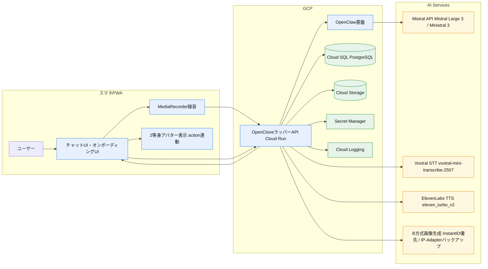

# OpenClone 設計書 v1.3（ハッカソン実装向け）

## 1. 目的
本書は [OpenClone 要件定義書](/Users/kokifunahashi/Documents/openclone/docs/requirements_definition.md) を実装可能な構成に落とし込むためのシステム設計を定義する。

## 2. 設計方針
- 優先順位:
  - 本人らしさ
  - 体感速度（応答開始1秒以下）
  - 実装速度（ハッカソン期間で完成）
- 方針:
  - OpenClawをバックエンド実行基盤として採用し、OpenCloneはラッパーUI/APIとして実装する
  - クラウドAPI活用を前提に最短構成で実装
  - LLMはMistralの推奨モデル群を利用する
  - 音声合成はElevenLabsを利用する
  - インフラはGCPに統一する
  - マイクロサービス分割は行わず、単一バックエンドで構築
  - 失敗時は「音声なしテキスト応答」に縮退して会話継続

### 2.1 採用モデル方針（アナウンス準拠）
- メイン応答生成:
  - `Mistral Large 3` を第一候補
- 軽量応答/低コスト応答:
  - `Ministral 3B/8B/14B` を用途別に選択
- 音声リアルタイム認識（将来オプション）:
  - `Voxtral Realtime`
- 前提:
  - MVPのSTTはVoxtral API固定
  - Web Speech APIは採用しない
  - モデルIDは固定値で運用し、`latest` エイリアスは使用しない

## 3. 全体アーキテクチャ
### 3.1 構成要素
- フロントエンド（PWA）
  - チャットUI、オンボーディングUI、ドット絵表示
  - 音声入力（MediaRecorder録音 + Voxtral転記）とテキスト入力
- OpenCloneラッパーAPI
  - 認証、会話API、オンボーディングAPI、ログ管理API
  - OpenClaw連携、人格プロファイル適用、セーフティフィルタ、TTS連携
- OpenClaw基盤
  - エージェント実行、モデル接続、チャネル制御
- データストア
  - ユーザー、人格プロファイル、会話ログ
- 外部サービス
  - Mistral API（人格反映応答生成、Structured Output）
  - ElevenLabs TTS API（音声合成）

### 3.3 GCPインフラ構成（MVP）
- `Cloud Run`: Next.jsアプリ/API実行基盤
- `Cloud SQL (PostgreSQL)`: ユーザー、人格、会話ログ保管
- `Cloud Storage`: 音声ファイル保管
- `Secret Manager`: APIキー管理（Mistral / ElevenLabs / OAuth）
- `Cloud Logging`: アプリログとレイテンシー計測ログ

### 3.2 データフロー（会話）
1. ユーザーがテキストまたは音声入力
2. OpenCloneラッパーAPIが会話履歴 + 人格プロファイルを付与してOpenClawへ送信
3. OpenClaw経由でLLMがStructured Output（`text` と `action`）を生成
4. 応答テキストを即時ストリーミング返却（actionは先行確定で返却可）
5. フロントが `action` に対応する2等身ドット絵モーションを再生
6. 並列でTTS生成し、準備でき次第音声URLを返却
7. フロントが最終状態を `idle` へ戻す

### 3.4 OpenClaw責務分離
- OpenClaw側:
  - エージェント実行ライフサイクル
  - LLM実行パイプライン
  - チャネル接続基盤
- OpenCloneラッパー側:
  - 人格プロファイル管理
  - Voxtral STT / ElevenLabs TTS
  - 2等身アバター制御
  - OpenClaw入出力のAPI整形

## 4. 画面設計（MVP）
### 4.1 画面一覧
- `onboarding/start`
  - 説明、所要時間（3〜5分）、開始ボタン
- `onboarding/question`
  - 5〜8問の質問を1問ずつ表示
  - 各質問の音声回答を必須とする（テキストは補助入力）
- `chat`
  - メッセージリスト
  - テキスト入力欄
  - 音声入力ボタン
  - 2等身ドット絵アバター（action連動）
- `settings/data`
  - 会話ログ削除（手動、メッセージ単位）
  - 人格再設定（オンボーディング再実行）

### 4.2 UX要件
- 復帰後24時間は会話履歴を維持
- 片手操作のため、入力領域を画面下部固定
- ネットワーク低速時は音声生成をスキップしてテキスト先行

## 5. バックエンド設計
### 5.1 モジュール
- `auth`
  - MVPはGoogleログインのみで実装
- `persona`
  - オンボーディング回答を正規化して人格プロファイル化
- `chat`
  - 応答生成、履歴保存、ストリーミング返却
- `tts`
  - ElevenLabs呼び出し、音声キャッシュ
  - Instant Voice Cloning API連携
  - フォールバック設計（テキスト縮退）

**TTS実装仕様:**
- **デフォルト動作: テキストのみ**（音声生成はデフォルトOFF）
- 使用モデル: `eleven_turbo_v2`（高速・低コスト）
- ユーザー操作: 「音声再生」ボタン押下時にのみTTS生成
- ストリーミングAPI: 低レイテンシー対応
- キャッシュ戦略: 同一テキストの24時間キャッシュ
- フォールバック: TTS失敗時はテキストのみ返却
- **コスト削減効果**: ユーザー選択式により、TTS使用量を70-80%削減（目標$70/月→$15-20/月）
- `safety`
  - 入力/出力検査、拒否応答生成
- `experiment-tracking`（W&B Weave連携）
  - LLM呼び出しのトレーシング（prompt、response、latency）
  - 「本人らしさ」評価スコアのログ記録
  - プロンプトA/Bテストの管理
  - ファインチューニング実施時は学習ログを記録

### 5.2 応答生成ロジック（本人らしさ担保）

**アプローチ: プロンプトエンジニアリング + RAG**
- 入力コンテキスト:
  - 最新Nターン会話
  - 人格プロファイル（口調、価値観、判断軸、NG表現）
  - 長期メモリ要約
- 出力制御:
  - 口調テンプレート層（語尾、一人称、呼称）
  - 判断方針層（優先順位ルール）
  - セーフティ層（NGカテゴリ拒否）
  - アクション選択層（発話意図に応じて `action` を選択）

**Mistral向けプロンプト構造:**
```
<system>
あなたは以下のペルソナとして振る舞ってください。

## 基本設定
- 名前: {name}
- 一人称: {first_person}
- 文体: {style}
- 語尾: {sentence_endings}

## 性格特性
- {trait_1}: {trait_1_description}
- {trait_2}: {trait_2_description}

## 価値観
大切にしていること:
- {value_1}
- {value_2}

判断基準:
1. {decision_criterion_1}
2. {decision_criterion_2}

## 会話例
{conversation_examples}

## 制約事項
- 不適切な要求には丁寧に断ってください
- ペルソナから逸脱しないようにしてください
</system>
```

**口調の多次元表現:**
- formality (0-1): 丁寧さ（タメ口〜敬語）
- energy (0-1): エネルギーレベル（冷静〜活発）
- directness (0-1): 直接性（遠回し〜ストレート）
- warmth (0-1): 温かさ（ドライ〜温かい）

**RAGによる会話履歴活用:**
- 会話履歴をベクトル化して保存（Sentence Transformers）
- 意味的チャンクへのセグメンテーション
- 関連性の高い過去発話の検索と注入

### 5.4 モデルルーティング設計（MVP）
- `default_chat_model`: `mistral-large-2512`
- `fast_chat_model`: `ministral-8b-2512`
- `cheap_background_model`: `ministral-3b-2512`
- `quality_chat_model`: `ministral-14b-2512`
- 使い分け:
  - 通常会話: `default_chat_model`
  - 低遅延優先（端末/回線悪化時の明示切替）: `fast_chat_model`
  - 将来バッチ処理（MVP外）: `cheap_background_model`
- 注意:
  - 自動フォールバックではなく、サーバ設定で明示切替する

### 5.3 Structured Output仕様（LLM）
- 目的:
  - テキスト生成とドット絵モーションを同期する
- 出力JSON（例）:
```json
{
  "text": "それ、いいね。まずは小さく試してみよう。",
  "action": "agree"
}
```
- `action` 候補（MVP）:
  - `idle`
  - `thinking`
  - `speaking`
  - `nod`
  - `agree`
  - `surprised`
  - `emphasis`
- 制約:
  - `action` は固定列挙値のみ許容
  - 無効値時は `speaking` に正規化

## 6. データモデル（MVP）
### 6.1 `users`
- `id`
- `auth_provider`
- `created_at`

### 6.2 `persona_profiles`
- `user_id`
- `style_traits`（口調、語彙）
- `decision_traits`（意思決定軸）
- `ng_topics`
- `voice_profile_ref`（ElevenLabs関連ID）
- `updated_at`

### 6.3 `onboarding_answers`
- `id`
- `user_id`
- `question_id`
- `answer_text`
- `answer_audio_url`
- `created_at`

### 6.4 `chat_messages`
- `id`
- `user_id`
- `session_id`
- `role`（user/assistant）
- `text`
- `action`
- `audio_url`（任意）
- `safety_flag`
- `created_at`

### 6.6 `motion_assets`
- `id`
- `action_name`
- `frame_sequence`（フレーム参照配列）
- `fps`
- `loop_flag`
- `created_at`

### 6.7 `pixelart_generation_jobs`
- `id`
- `user_id`
- `status`（queued/processing/completed/failed）
- `photo_url`（元写真のCloud Storageパス）
- `assets_prefix`（生成アセットのCloud Storageパス）
- `progress`（0-100）
- `error_message`（失敗時）
- `started_at`
- `completed_at`

## 7. API設計（MVP）
### 7.1 認証
- `POST /api/auth/login`
- `POST /api/auth/logout`
- `GET /api/auth/me`

### 7.2 オンボーディング
- `POST /api/onboarding/start`
- `POST /api/onboarding/answers`
- `POST /api/onboarding/photo-upload`（写真アップロード）
  - 入力: photo file (multipart/form-data)
  - 処理: Cloud Storage保存 + ドット絵生成ジョブ起動
  - 出力: job_id, status
- `POST /api/onboarding/voice-upload`（音声収集）
  - 入力: audio file (multipart/form-data)
  - 処理: ElevenLabs Instant Voice Cloning
  - 出力: voice_id
- `GET /api/onboarding/pixelart-status/{job_id}`
  - 出力: status (queued/processing/completed/failed), progress
- `POST /api/onboarding/complete`
  - 完了条件: 5〜8問すべてで音声回答が保存済み

### 7.3 会話
- `POST /api/chat/send`
  - 入力: `text | audio_transcript`
  - 出力: `streamed_text`, `action`, `audio_url`
- `GET /api/chat/history?session_id=...`

### 7.4 データ管理
- `DELETE /api/data/chat-logs/{message_id}`
  - 無期限保存データをユーザー操作でメッセージ単位削除

## 8. セーフティ設計（MVP最小ガードレール）

### 8.1 ブロック対象
- 違法行為の具体的支援
- 差別/ヘイトスピーチ
- 露骨な性的コンテンツ
- 自傷他害の具体的助長
- 個人情報の不正取得・漏えい誘導

### 8.2 実装方式（MVP最小構成）
- **Mistral safe_prompt**: `safe_prompt=true` をAPI呼び出し時に設定
- **Delimiter-based separation**: システムプロンプトとユーザー入力を明確に分離
- **出力フィルタ**: 簡易的なNGワードチェック（日本語・英語）
- **拒否応答**: 「ごめんね、その話題はちょっとNGなんだ」といった本人口調での断り

### 8.3 v1.1以降の拡張予定
- LLMベースの入力・出力検査
- PIIマスキング/抑制チェック
- セーフティフィルタの誤検知統計と改善ループ

## 9. レイテンシー設計
### 9.1 目標
- 送信完了から初回文字表示まで `p95 <= 1.0秒`

### 9.2 予算配分（目安）
- API受信〜プロンプト構築: 120ms
- LLM初回トークン: 450ms
- 回線往復 + 描画: 180ms
- バッファ: 250ms

### 9.3 実装テクニック
- ストリーミング応答を必須化
- 会話履歴は長文全量ではなく要約+直近Nターン
- TTSは非同期並列（テキスト表示を待たせない）
- よく使う人格情報はメモリキャッシュ

## 9.4 STT運用方針（MVP）
- STTは **Mistral Voxtral API** を採用する（iOS Safari対応のため）
- **実装方式**:
  - クライアント: MediaRecorder APIで音声録音
  - サーバー: 録音ファイルをMistral Voxtral APIに送信して転記
  - レスポンス: 転記テキストをストリーミングで返却
- **採用モデル**: `voxtral-mini-transcribe-2507`（固定ID）
- **対応ブラウザ**: `iOS Safari` と `Android Chrome`（MediaRecorder API対応）
- **音声フォーマット**:
  - サンプリングレート: 16kHz
  - フォーマット: WAV/WebM
  - 最大録音時間: 30秒/回
- **将来検討事項**:
  - Voxtral Realtime APIへの切替（低レイテンシー要求時）
  - 自動フォールバックは実装しない

## 9.5 モーション資産運用（MVP）
- 顔のみを本人似せで生成し、体は2等身テンプレート合成で構成する
- 生成後は `motion_assets` に登録し、ランタイムでは再生成しない
- LLMはフレームを直接生成せず、`action` ラベルのみ返す

### 9.5.1 顔生成 + 体テンプレ合成（B方式 / MVP採用）

**方式概要**
1. オンボーディングで顔アップ画像を1枚アップロード
2. 顔検出/ランドマーク抽出で顔領域を正規化
3. 顔領域をドット絵化（パレット量子化 + ピクセル化）
4. 2等身体テンプレート（性別 x 服装）に顔を合成
5. モーションは体テンプレ側フレームを再生し、顔は共通レイヤとして追従

**体テンプレート**
- 性別: `male`, `female`
- 服装: `formal`, `casual`
- 頭身: `2等身` 固定
- 合計4系統をMVP基本セットとする

**技術スタック（MVP）**
- 顔生成: **IP-Adapter + Canny ControlNet + Pixel Art LoRA**（SDXLベース）
  - IP-Adapter scale: 0.6-0.7（顔特徴維持）
  - Canny ControlNet scale: 0.3（輪郭維持）
  - Pixel Art LoRA scale: 0.8（ドット絵スタイル適用）
- 合成: アルファマスク + affine変換で顔を首位置に配置
- 配信: Cloud StorageにPNGスプライト保存

**生成解像度**
- 推奨: `96x96`（スマホ表示で十分な視認性）
- 高精細: `128x128`（必要時）

**生成コスト/速度**
- 1ユーザーあたり生成は数十秒〜数分想定（GPU利用前提）
- オンボーディング時に非同期ジョブで生成し、完了後に反映する

**制約**
- MVPは「顔の類似度と表情バリエーション優先」
- 顔画像品質が低い場合は手動リトライ導線を提供

### 9.5.2 方式採用（MVP標準）
**生成モデル方式（IP-Adapter + Canny ControlNet + Pixel Art LoRA）**
- SDXLベースで顔ドット絵を生成
- 1枚写真から複数表情の顔ドット絵を生成
- 顔類似度とキャラ感を優先
- IP-Adapter scale: 0.6-0.7、Canny ControlNet scale: 0.3

**代替実装候補（A方式）**
- MediaPipe + OpenCV + Pillowで顔ドット絵を生成
- 2等身体テンプレートに合成
- 生成モデルが品質/運用要件を満たさない場合のみ採用

**切替条件**
- 週次サンプル評価で類似度3.5未満の場合、A方式への切替を検討
- 自動フォールバックは行わず、運用判断で切替する
### 9.5.3 オンボーディング音声収集フロー

**音声収集方式: Instant Voice Cloning**
- 所要時間: 3〜5分
- サンプル要件: 1〜5分の音声
- 録音セッション: 5セッション構成
- オンボーディング質問への音声回答は必須

**セッション構成:**
1. 日常会話（約30秒）: 自然な挨拶と日常会話
2. 感情表現-喜び（約20秒）: ワクワクする表現
3. 感情表現-驚き（約20秒）: 驚きの表現
4. 説明文（約30秒）: 説明するスタイル
5. 自由発話（約30秒）: 自由に話す

**音声品質要件:**
- フォーマット: MP3, WAV, M4A, OGG
- サンプリングレート: 44.1kHz 以上
- ビットレート: 128kbps 以上（推奨192kbps）
- 録音環境: 背景ノイズのない静かな環境

**UI設計:**
- ステップ1: 説明画面（所要時間、プライバシー説明）
- ステップ2: 環境チェック（マイク権限、ノイズレベル）
- ステップ3: 録音画面（スクリプト表示、録音ボタン）
- ステップ4: 確認画面（再生、録り直し、次へ）

## 10. 人格確定方針（MVP）
1. オンボーディング回答を元に `persona_profiles` を確定する
2. MVP中は会話ログによる自動更新を行わない
3. 人格変更が必要な場合はオンボーディング再実行で更新する

## 11. 運用設計（ハッカソン）
- 監視最小構成:
  - APIエラー率
  - 応答開始レイテンシー（p50/p95）
  - TTS失敗率
- 障害時縮退:
  - TTS停止 -> テキストのみ継続
  - 画像生成停止 -> 既存アバターで継続

## 11.1 W&B Weave活用設計

### 11.1.1 目的
- Mistralモデルのファインチューニング（FTトラック時）、評価、実験管理をWeaveで統括
- OpenClaw経由のLLM呼び出しを包括的にトレーシング
- 人格プロファイル、アバター生成品質、プロンプト実験を管理
- LLMアプリケーションの品質監視と改善サイクルを回す

### 11.1.2 管理対象

**トレーシング（OpenClaw経由のLLM呼び出しログ）:**
- OpenClowチャネルID（呼び出し元の追跡）
- プロンプト（システムプロンプト + 人格プロファイル + ユーザー入力）
- レスポンス（text + action）
- レイテンシー（OpenClaw呼び出し〜LLM初回トークン時間、総応答時間）
- トークン数（入力/出力）
- モデル名（mistral-large-2512等）
- 人格プロファイルバージョン（persona_profile_v1.0等）

**評価（「本人らしさ」指標）:**
- ユーザー自己評価（5段階）
- 応答速度満足度（5段階）
- Day 7リテンション率
- プロンプトA/Bテスト結果

**実験管理:**
- プロンプトテンプレートのバージョニング
- 人格プロファイルのバージョニング（オンボーディング完了時のスナップショット）
- アバター生成方式のA/Bテスト（InstantID vs IP-Adapter）
  - 生成品質スコア（顔類似度、破綻率）
  - 生成時間、GPU使用率
- ハイパーパラメータ（温度、top_p等）

### 11.1.3 人格プロファイルのバージョニング

**オンボーディング完了時のスナップショット:**
```typescript
import weave

weave.init("openclone")

// 人格プロファイルをWeaveオブジェクトとして保存
@weave.op()
async function savePersonaProfile(onboardingAnswers: OnboardingAnswers) {
  const profile = await buildPersonaProfile(onboardingAnswers)

  // Weaveでバージョン管理
  const personaVersion = weave.publish(
    profile,
    name = `persona_${userId}`,
    description = `オンボーディング完了時の人格プロファイル v${version}`
  )

  // データベースにも保存
  await db.persona_profiles.create({
    user_id: userId,
    profile_data: profile,
    weave_version: personaVersion.version,
    created_at: new Date()
  })

  return personaVersion
}
```

**人格変更時の追跡:**
```typescript
// オンボーディング再実行時
const newPersonaVersion = await savePersonaProfile(newAnswers)

// 変更点のログ記録
weave.log({
  event_type: "persona_updated",
  user_id: userId,
  old_version: oldPersonaVersion,
  new_version: newPersonaVersion.version,
  changes: diffPersonaProfiles(oldPersona, newPersona)
})
```

### 11.1.4 アバター生成のA/Bテスト

**InstantID vs IP-Adapterの比較:**
```typescript
@weave.op()
async function generatePixelart(photoUrl: string, method: "instantid" | "ip-adapter") {
  const startTime = Date.now()

  // 生成実行
  const result = method === "instantid"
    ? await generateWithInstantID(photoUrl)
    : await generateWithIPAdapter(photoUrl)

  const generationTime = Date.now() - startTime

  // 品質評価（自動スコアリング）
  const qualityScore = await evaluateQuality(result, photoUrl)

  // Weaveでログ記録
  weave.log({
    user_id: userId,
    generation_method: method,
    generation_time_ms: generationTime,
    quality_score: qualityScore,
    face_similarity: qualityScore.faceSimilarity,
    breakdown_rate: qualityScore.breakdownRate,
    gpu_utilization: qualityScore.gpuUtilization
  })

  return result
}
```

### 11.1.5 実装方針（MVP）

**APIトラック（OpenClaw経由）:**
```typescript
import weave

weave.init("openclone")

// OpenClaw経由のLLM呼び出しのトレーシング
@weave.op()
async function generateResponse(
  userInput: string,
  personaProfile: PersonaProfile,
  channel_id: string
) {
  // 人格プロファイルのバージョンを付与
  const prompt = buildPrompt(userInput, personaProfile)

  const response = await openclawClient.execute({
    channel_id: channel_id,
    model: "mistral-large-2512",
    messages: [
      { role: "system", content: personaProfile.systemPrompt },
      { role: "user", content: userInput }
    ]
  })

  // Weaveでトレーシング
  return {
    text: response.text,
    action: response.action,
    persona_version: personaProfile.version,
    latency_ms: response.latency,
    tokens: response.usage
  }
}
```

**評価パイプライン:**
```typescript
// 「本人らしさ」評価のログ記録
weave.log({
  user_id: userId,
  evaluation_type: "self_assessment",
  score: 4,  // 5段階評価
  prompt_version: "v1.2",
  timestamp: new Date()
})
```

**ファインチューニング・トラック（FT）:**
- 学習ログ: loss、learning_rate、epoch
- 評価結果: validation_accuracy、「本人らしさ」スコア
- モデルアーティファクト: チェックポイントの保存

### 11.1.4 Weaveドキュメント参照
- `weave/tracing-basics_ja.md`: トレーシング基礎
- `weave/evaluation-pipeline_ja.md`: 評価パイプライン構築
- `weave/weave-projects_ja.md`: プロジェクト管理と組織化

## 12. 実装順序（推奨）
0. **W&B Weave導入**（最初にセットアップ）
   - プロジェクト初期化: `weave.init("openclone")`
   - LLM呼び出しのトレーシング実装
   - 評価指標のログ記録
1. `chat` のテキスト応答をストリーミングで成立
2. `onboarding` 保存 + 人格プロファイル生成
3. TTS連携 + ドット絵状態同期
4. セーフティフィルタ導入
5. ログ削除UI導入

## 13. 確定事項
以下は、2026-02-28時点で本プロジェクトのMVP仕様として確定している事項。

1. アーキテクチャ方針
- OpenClawをバックエンド実行基盤として採用する
- OpenCloneはユーザー向けラッパーUI/APIとして実装する
- 単一バックエンド構成（マイクロサービス分割なし）

2. 技術スタック
- フロントエンド: `Next.js`（スマホPWA）
- バックエンド: `Node.js (TypeScript)`（Cloud Run）
- インフラ: `GCP`
- 認証: `Googleログインのみ`

3. モデル採用方針（固定ID運用）
- LLM:
  - `mistral-large-2512`（標準）
  - `ministral-8b-2512`（低遅延用）
  - `ministral-3b-2512`（軽量/将来バッチ用）
  - `ministral-14b-2512`（品質優先用）
- STT:
  - `voxtral-mini-transcribe-2507`
- TTS:
  - ElevenLabs `eleven_turbo_v2`
- モデルIDは `latest` エイリアスを使わない

4. 音声I/O仕様
- 音声入力は `MediaRecorder + Voxtral API` を標準採用
- `Web Speech API` は採用しない
- 外部STTの自動フォールバックは実装しない
- TTSはデフォルトOFF（ユーザーが音声再生を選択した時のみ生成）

5. オンボーディング仕様
- 所要時間: `3〜5分`
- 質問数: `5〜8問`
- 各質問の音声回答は必須（ElevenLabs声質再現データのため）
- 人格プロファイルはオンボーディング完了時に確定
- MVP中は会話ログによる人格自動更新を行わない

6. アバター仕様
- 2等身アバター固定
- 体テンプレ: `male/female x formal/casual` の4種
- 画像生成はB方式（生成モデル併用）をMVP標準採用
- 生成モデル優先順位:
  - 第1候補: InstantID
  - バックアップ: IP-Adapter
- LLMのStructured Outputで `text` と `action` を分離

7. セーフティ・運用
- MVPは回答専用エージェント（外部アクション実行は無効）
- 会話ログは無期限保存、メッセージ単位削除
- 対応ブラウザは `iOS Safari` と `Android Chrome`
- 実験管理は **W&B Weave** を標準採用

## 14. 関連文書
- モデル実現可能性評価:
  - [model_feasibility_assessment.md](/Users/kokifunahashi/Documents/openclone/docs/research/model_feasibility_assessment.md)
- 顔ドット絵 + 体テンプレ合成の実現可能性:
  - [face_only_avatar_feasibility.md](/Users/kokifunahashi/Documents/openclone/docs/research/face_only_avatar_feasibility.md)
- drawio MCPで生成した構成図:
  - [architecture_drawio_mcp.md](/Users/kokifunahashi/Documents/openclone/docs/research/architecture_drawio_mcp.md)
- Mermaidのフロー図・シーケンス図:
  - [mermaid_flow_and_sequence.md](/Users/kokifunahashi/Documents/openclone/docs/research/mermaid_flow_and_sequence.md)
- OpenClaw調査メモ:
  - [openclaw_research.md](/Users/kokifunahashi/Documents/openclone/docs/research/openclaw_research.md)
- UI/UX設計（オンボーディング/メイン画面）:
  - [uiux_design_onboarding_main.md](/Users/kokifunahashi/Documents/openclone/docs/research/uiux_design_onboarding_main.md)

## 14.1 Draw.io 図版（MCP生成）
- Draw.io URL:
  - https://app.diagrams.net/?grid=0&pv=0&border=10&edit=_blank#create=%7B%22type%22%3A%22mermaid%22%2C%22compressed%22%3Atrue%2C%22data%22%3A%22jVRtj6IwEP41Te4%2BmCCIlo%2Bl4sYEo6eud982FYtLjqObgu79%2FJsplFW25jZBHGbmeTqvzUv1nr0K3RDfS7fEY%2FAPT305nrV4ewWRl4WsGhLGxPdJEhDqkzgyQkCixArx5idDh3Dec7TP8w0yIGzaCTG3XDcaJ355R0DHlimwml6g4NtxxR07Y1ZjvSJ%2BHwE8M%2Bsc3DtDcHi8K6ptwtuwVvJUiK3MlD5JTZKIUE5iH4VogTwuMDu0WHCbETYnFMpJScwI68O26UaejWRxEzYlbEwYNfAJAn1PZE2hKhOAZxIJCY1JFA4CkNUJZUebn%2FimjQoFZ9SbrhPrN1nxUlXSdiIadiIa98EiCmdIXU5Ytkvl5F7z9JZbvGP8WECGOUYxpunCzWOAfQOTPWD3I4X3RtXNWUvz4X%2F%2FDNvth7BGaXGWD7xtr3cy0xIXZSUq8NbOkNL1U%2BttuVN1PhfV%2BcuNYF2ZGRZuJ%2FW1yGTtPGq133ZDWNSNFmXXJDD036nQmJYXGMTC2Kre6h7Pw%2FpXS3tQfzvH3X4P72v7PfoDFCOQqjrTxVGO%2FNCbOZmSrqtJKa%2BySsUR8vD2%2Bx3mb1QvzUUf1cvVd8KXq66UsBZTEk3NvRPiBtCFmYuJWfTQzJ7VwNSAM6W4OkBR1Y2omuXcuE3MfQBCiA62IsvNiJ3EW4P7e7t0%2FUDDPi6Gi%2Fkx68PUB519ht9oRIKkvct69fJGj7eJNaD8YcF%2BOiGdwdravlsjrpO1oPxhwZFxY7DrbkuSPjBgfx7GAKvpNsDyuQ24OQ8gbX3cxkdFhVv2BpOVoq7nMkdRaVyJvChLEoA5kDT3clBx2Av1W7bKsZiBAZSZKpXudOMxCWIXZ918Ip3mEymGpJR6wZdJRXHHmMt8Jr0BoxR06nn%2FZ7Rl42YeOFaKm1HjUKeuJg4MdNHn0DF4GWfskc3W4Y7j5XMcJZ8neA6OiEkkiP8B%22%7D
- Mermaidソース:


## 15. コスト見積もりと最適化戦略

### 15.1 ElevenLabs TTSコスト

**前提条件（オプション化後）:**
- 1ユーザーあたり1日平均100ターンの会話
- 音声再生利用率: 20-30%（ユーザー選択式）
- 1ターンあたり平均50文字
- 1ヶ月30日

**計算:**
```
月間文字数（音声利用） = 100ターン/日 × 30% × 50文字 × 30日 = 45,000文字/ユーザー/月
```

**最適化適用前（ユーザー選択式）:**
| ユーザー数 | 月間総文字数 | 推定月額コスト |
|----------|-------------|----------------|
| 10 | 1,500,000 | Enterprise要相談 |
| 100 | 15,000,000 | Enterprise要相談 |
| 1,000 | 150,000,000 | Enterprise要相談 |

**Enterpriseプランでの見積もり目安:**
- $0.001〜$0.002/文字（ボリュームディスカウント適用後）
- 150,000文字/ユーザー/月 × $0.0015 = **$225/ユーザー/月**

### 15.2 コスト最適化戦略

**0. ユーザー選択式（期待削減率: 70-80%）**
- デフォルト: テキストのみ
- 音声再生はユーザーが「音声再生」ボタンを押した時のみ生成
- TTS使用頻度を全ターンの20-30%に削減

**1. キャッシュ戦略（期待削減率: 40%）**
- 同一テキストの24時間キャッシュ
- Redisでキャッシュ管理
- 定型表現の事前生成

**2. モデル選択最適化（期待削減率: 25%）**
| シーン | 推奨モデル | 理由 |
|--------|-----------|------|
| 通常会話 | `eleven_turbo_v2` | レイテンシー優先 |
| 重要な発話 | `eleven_multilingual_v2` | 品質優先 |

**総合コスト削減効果（ユーザー選択式 + キャッシュ）:**
| 項目 | 削減率 | コスト |
|------|--------|--------|
| ベース（全ターン音声） | - | $225/ユーザー/月 |
| ユーザー選択式 | -75% | $56 |
| キャッシュ適用 | -40% | $34 |

**目標コスト: $30〜$50/ユーザー/月（現実的）**

### 15.3 ドット絵生成コスト

**オンデマンド生成方式（MVP採用）:**
| 項目 | コスト |
|------|--------|
| Cloud Run + GPU L4 | $300-500/月（固定） |
| 推論（1ユーザーあたり） | $0.01-0.02 |
| Cloud Storage | $0.0005/ユーザー/月 |
| 合計（1ユーザー） | $0.01-0.02（初期のみ） |

**詳細内訳:**
- 70枚生成（並列処理）
- L4 GPU使用時間: 約1分/ユーザー
- $0.50/時間 × 0.017時間 = 約$0.01

**高品質方式（v1.1以降）:**
| 項目 | コスト |
|------|--------|
| LoRA訓練 | $0.03-0.05/ユーザー |
| 推論（ユーザー専用LoRA） | $0.02-0.05/ユーザー |
| 合計 | $0.05-0.10/ユーザー |

**スケール想定:**
| ユーザー数 | 月間コスト（MVP） | 月間コスト（高品質） |
|----------|------------------|-------------------|
| 10 | $0.10-0.20 | $0.50-1.00 |
| 100 | $1-2 | $5-10 |
| 1,000 | $10-20 | $50-100 |

## 16. 技術調査レポート

詳細な技術調査結果は以下のドキュメントを参照：

1. **ドット絵生成技術**
   - [research_pixelart_generation.md](/Users/kokifunahashi/Documents/openclone/docs/research/research_pixelart_generation.md)
     - Stable Diffusion、ControlNet、ComfyUI による実装手法
   - [photo_to_pixelart_guide.md](/Users/kokifunahashi/Documents/openclone/docs/research/photo_to_pixelart_guide.md) ✅
     - 写真から似たドット絵を再現する技術ガイド（MVP採用方式）

2. **LLM人格再現**
   - [research_llm_personification.md](/Users/kokifunahashi/Documents/openclone/docs/research/research_llm_personification.md)
     - Mistralモデルでのプロンプト設計、RAG手法

3. **ElevenLabs音声再現**
   - [research_elevenlabs_voice_cloning.md](/Users/kokifunahashi/Documents/openclone/docs/research/research_elevenlabs_voice_cloning.md)
     - Voice Cloning API、コスト構造、キャッシュ戦略
